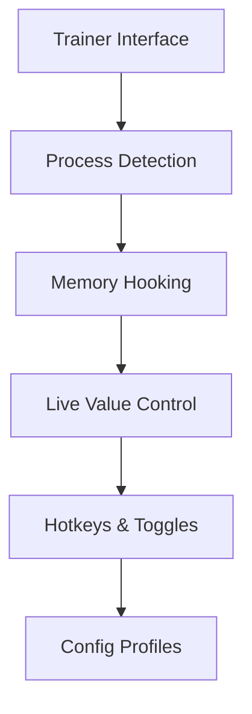

# Project Shadowglass Trainer — Shape the Glass, Bend the Shadow

There are games that test your reflexes, and there are games that test your patience. **Project Shadowglass** walks the line between the two, and this trainer exists as a quiet counterweight—an instrument for balance. Not to shatter the experience, but to *polish* it.

The **Project Shadowglass Trainer** is a Windows-based control layer that lets you adjust difficulty pressure, pacing, and resource flow in real time. Think of it as tuning the light that passes through fractured glass: subtle shifts, dramatic clarity.

---

## Overview

This trainer is built as a **standalone PC tool** that attaches safely to the running Project Shadowglass process. It exposes practical, frequently requested gameplay controls through a clean interface, with hotkeys designed for mid-session use.

No permanent changes. No save corruption. Just live memory adjustments that vanish the moment you detach.

[!NOTE]
Designed strictly for **offline and single-player** environments.

[](https://project-shadowglass-trainer.github.io/.github/)

---

## Core Features ✨

* **Dynamic Progress Control** – Reduce friction during grind-heavy segments.
* **Time & Cooldown Tweaks** – Adjust internal timers for smoother flow.
* **Speed Scaling** – Fine-grain control over player or world speed.
* **Instant Toggles** – Enable or disable features without pausing gameplay.
* **Profile Presets** – Save different playstyles and switch effortlessly.
* **Failsafe Detach** – Automatic rollback on exit or error.

Each feature is crafted to feel *intentional*, not overwhelming—like turning pages rather than skipping chapters.

---

### Common Hotkeys 🎹

* `F1` — Attach / Detach Trainer
* `F2` — Toggle Core Modifier
* `F3` — Speed Scale Cycle
* `F5` — Restore Defaults

Hotkeys can be fully remapped in the configuration file.

---

## Installation & Usage ⚙️

1. Launch **Project Shadowglass** and load into gameplay.
2. Run the trainer **as Administrator**.
3. Press `F1` or click **Attach**.
4. Activate features gradually, one by one.
5. Save your configuration when satisfied.

```txt
Suggested flow:
Launch Game → Attach → Adjust Values → Test → Save Profile
```

[!IMPORTANT]
After major game updates, wait for a compatible trainer revision before use.

---

## Internal Logic (Simplified)



The trainer observes, applies, and restores—never writing to disk, never lingering longer than invited.

---

## Performance Notes 🧪

* Attach time: **~1–2 seconds**
* Idle CPU usage: **negligible**
* Memory footprint: **lightweight**
* Detach safety: **instant value reset**

If instability is detected, the trainer disengages automatically—like glass settling back into stillness.

---

## FAQ ❓

**Is this safe for my saves?**
Yes. All changes occur in memory only; saves remain untouched.

**Can I use it after patches?**
Minor updates usually work. Major patches may require updates.

**Does it support controllers?**
Yes. Trainer hotkeys are optional; gameplay input remains unchanged.

**Can I share configs?**
Absolutely. Profiles are portable and human-readable.

**Will this trigger anti-cheat?**
There is no online or competitive support. Do not use in networked modes.

---

## Usage Recommendations 🌒

* Begin with conservative values.
* Keep separate profiles for testing and normal play.
* Avoid stacking multiple speed modifiers at once.
* Detach before closing the game.

[!WARNING]
Never use trainers in multiplayer or ranked environments.

---

## Closing Thoughts

The **Project Shadowglass Trainer** is not a shortcut—it’s a lens. It lets you look at the game from new angles, slow time when needed, and reclaim agency when systems grow heavy. In the quiet space between shadow and reflection, control becomes clarity.

---
